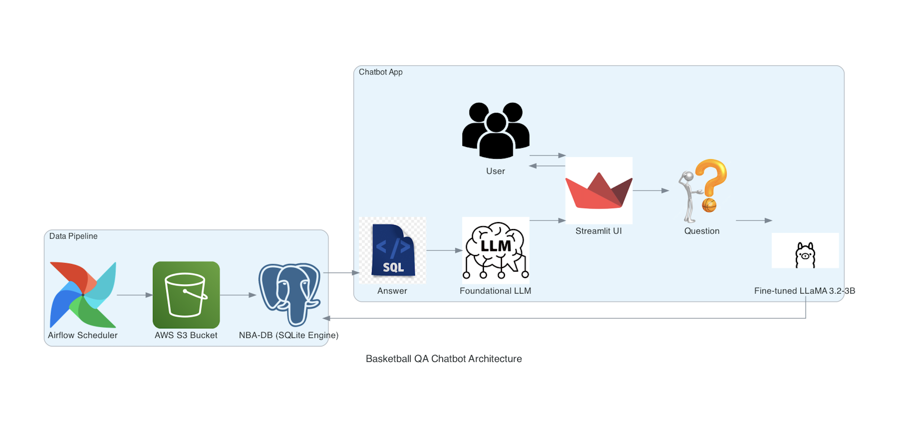

# End-to-End-Basketball-QA-RAG-Capstone

## Project description
This project aims to democratize basketball analytics by addressing the challenges non-technical users face when working with complex datasets due to limited SQL expertise. By developing a fine-tuned LLM-powered system, the project simplifies SQL query generation, ensuring accurate and consistent data-driven insights. The ultimate goal is to make analytics accessible, enabling better coaching strategies, player evaluations, and fan engagement while tackling key issues like LLM hallucinations and inconsistencies.

Project link: https://akshaysyal-end-to-end-basketball-qa-rag-c-chatbotappapp-tgfmap.streamlit.app/
Project Presentation: https://docs.google.com/presentation/d/1uFcptlnXr7_zXIwQ35wKjbzXAK7Y4Tn1hrhLyzUOe2Y/edit?usp=sharing

## Project Architecture




## Purpose 
These are our technical goals for this project:
- Fine-tune an open-source LLM for generating semantically correct SQL queries to answer Analytics Queries
- Deploy the LLM on cloud
- Deploy Chatbot application created using LangChain
- Apply Object-Oriented Design Principles to enhance code quality and maintainability for critical scripts (eg: Benchmarking Script)
- Create an orchestration workflow to augment data and build a custom dataset for fine-tuning
## Dataset details and link
There are 2 types of data
- NBA Database: Contains personal and professional attributes of NBA players. It is a SQLite Database consisting of 16 tables, 2.33 GBs of data, and is updated daily.
Link: https://www.kaggle.com/datasets/wyattowalsh/basketball

- QA Dataset: Contains basketball questions, their corresponding SQL queries and answers in a natural conversational tone. We collected this dataset from an online course, Improving Accuracy of LLM Applications from DeepLearning.ai. The dataset was specifically generated to fine-tune an LLM to accurately translate user basketball queries to SQL queries. Test set consists of 40 QA pairs while Training set consists of 313 QA pairs.
Links
- - https://github.com/AkshaySyal/End-to-End-Basketball-QA-RAG-Capstone/blob/main/data/test%20data/gold-test-set-v2.jsonl
- - https://github.com/AkshaySyal/End-to-End-Basketball-QA-RAG-Capstone/blob/main/data/train%20data/generated_queries_large_filtered.jsonl

## Setup Instruction
## To run the chatbotapp
1. Clone the repository to your local machine:
   ```bash
   git clone <repository-url>
   cd End-to-End-Basketball-QA-RAG-Capstone
2. Switch to the Chatbot branch
   ```bash
   git checkout chatbotapp
3. Create and Set up your Environment
   ```bash
   python -m venv venv
   source venv/bin/activate
4. Install the packages using `requirements.txt`
   ```bash
   pip install -r chatbotapp/requirements.txt
5. Add your api key, hugging face token and database path(sqlite database path)
   Create a .env file in chatbotapp/ and add:
   ```bash
   OPENAI_API_KEY=your_openai_api_key_here
   HUGGINGFACE_API_TOKEN=your_huggingface_token_here
   DATABASE_PATH=path/to/your/database.db
6. To run the streamlit application
   ```bash
   streamlit run chatbotapp/app.py

## Hosting the model
I explored 2 ways to host the LLM
1. SageMaker JumpStart
   I used Jumpstart in SageMaker Studio to create endpoint for Llama-3.2-instruct. Notebook: https://github.com/AkshaySyal/End-to-End-Basketball-QA-RAG-Capstone/blob/infra/Inference%20Llama%203.2-3B%20SageMaker.ipynb
2. Ollama + ngrok
   To host the model without incurring cost for cloud computing I use Ollama to run Llama models locally on my laptop and convert my laptop into a server and expose a public URL using ngrok.
   - Download Ollama: https://ollama.com/download
   - Setting up ollama
   ```bash
   ollama pull llama3.2:3b
   ollama serve
   ```
   - Setting up ngrok
   ```bash
   brew install ngrok
   ```
   - Create free account on ngrok website to get auth_token: https://dashboard.ngrok.com/
   ```bash
   ngrok config add-authtoken <auth_token>
   ngrok http 11434 --host-header=localhost
   curl -X POST "https://03ce-2601-19b-481-1350-d10b-adec-1ef5-49b4.ngrok-free.app/api/generate" \
     -H "Content-Type: application/json" \
     -d '{
           "model": "llama3.2",
           "prompt": "write me 300 word essay on AI",
           "stream": false
         }'

## Model Training
Install the following libraries:
- !pip install unsloth
- !pip uninstall unsloth -y && pip install --upgrade --no-cache-dir --no-deps git+https://github.com/unslothai/unsloth.git@nightly git+https://github.com/unslothai/unsloth-zoo.git
- !pip install bitsandbytes
- !pip install accelerate
- !pip install --upgrade transformers
- !pip install --upgrade peft
- !pip install --upgrade datasets
- !pip install trl
- !pip install unsloth

